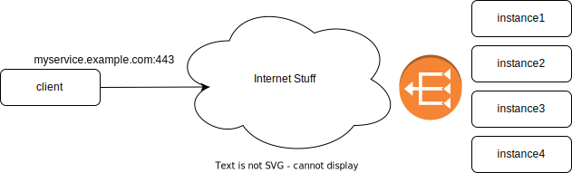
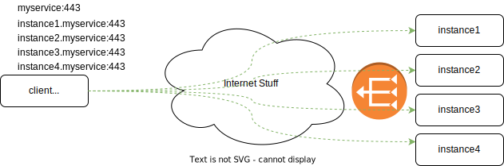
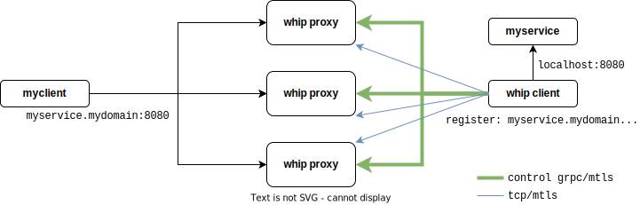

Whip - A reverse tcp/mtls framework and http proxy
---

Whip is a reverse tcp/mtls framework that can be used to establish client/server topologies in a reverse fashion where servers initiate tcp connections to a broker (whip server) then these reverse connections are used by clients.

Whip fully supports mutual TLS authentication and verification for both control gRPC calls and reverse tcp.

**NOTE: Be careful when using whip as it may bypass all network and software security measures when not configured and used correctly!**

### Background

The primary use-case for whip is to enable direct reverse tcp connections that bypasses all the forward-path. In my case, we had a bunch of services that were running behind multiple proxy servers. We wanted a way to experiment reducing the number of proxies but it was impossible to do due to the complexity of network topology across the forward path.

Whip was created to give us a way to have a direct connection from inside-out to our experimental components while maintaining direct addressability to each individual instance.

|Forward client/server (traditional)|Reverse tcp client/server (whip)|
|-|-|
|||

### How it works
Whip works be running a client with each service instance, typically as a side-car container. Whip client is configured with a virtual hostname and domain name such as `instance1.myservice`. Then the client establishes a gRCP control connection to Whip server and awaits connection initiation commands. Whenever a client wants to connect, Whip server will resolve the hostname and requests a reverse tcp connection from the corresponding whip client. Finally and end-to-end tcp stream is created.



For example, `myclient` above direct directly address any of the `myservice` instances by name.

### Features

* Full mTLS support: both control grpc and tcp connections are mTLS authenticated and verified.
* Direct instance addressability: outside clients can address any inside service instance by name.
* Domain addressability: outside clients can address whip clients by domain. In that case, whip picks one of the registered clients under that domain at random.
* Clients connect to all available whip service instances (1:many).
* Clients continuously discover and update connections to whip control service using DNS.
* Prometheus metrics coverage for latencies and active connections.

|Metric|Description|
|-|-|
|`whip_server_active_registrations`|Current registered whip clients by domain.|
|`whip_server_active_connections`|Current active connection count by domain.|
|`whip_server_tcp_connection_latency`|Latency histogram of connection initiation latency by domain.|
|`whip_server_client_round_trip_latency`|Continuous measurement of RTT to each client by domain.|
|`whip_client_active_connections`|Current active connections from client side.|
|`whip_proxy_requests_total`|Total number of requests by http status code.|

### Building

* Binaries

```bash
$ make binaries
```

* Docker image

```bash
$ make dockerbuild
```

### Using

There are two ways you can use whip:
* As a Go library for your client app
* Use the bundled `whip proxy` as an http proxy for your clients (for experimentation only).

#### (optional) Create TLS certificates

Unless you are testing on localhost, it is highly recommended that you use mTLS even if it is not production. To make it easy, you can use `whiphack pki` tools to generate self-signed certificates for testing:
```bash
$ # create self-signed ca
$ bin/whiphack pki genselfsignedca
$ # output files by default: ca-cert.pem, ca-key.pem.
$
$ # create whip server tls certificate
$ bin/whiphack pki createandsign server
$ # output files by default: cert.pem, key.pem
$
$ # create wild-card certificate for whip clients *.testdom
$ bin/whiphack pki createandsign client --hostname=* --domain=testdom
```

#### `whip proxy`

For experimentation and testing, you can use the bundled `whip proxy` as an http proxy. While it is a fully functionality http proxy, it is not recommended for production use.

* Start client on remote node (your server side), or a side-car container
```bash
$ # service instance is listening on 5051
$ # this will register the instance with mywhipserver.example.com as instance1.testdom
$ bin/whip client \
    --hostname=instance1 \
    --domain=testdom \
    --tls=true \
    --tls-key-path=client-key.pem \
    --tls-cert-path=client-cert.pem \
    --tls-ca-cert-path=ca-cert.pem \
    --ports=5051 \
    mywhipserver.example.com:50051
```

* Start whip proxy on your client side
```bash
$ # start http proxy
$ # the proxy must be externally reachable on mywhipserver.example.com ports 8000 (tcp) and 50051 (grpc)
$ bin/whip proxy \
    --proxy-listen-port=8080 \
    --whip-external-tcp-address=mywhipserver.example.com \
    --whip-external-tcp-port=8000 \
    --tls=true \
    --tls-key-path=server-key.pem \
    --tls-cert-path=server-cert.pem \
    --tls-ca-cert-path=ca-cert.pem \
    --whip-grpc-listen-port=50051
```

* Call remote service
```bash
$ curl --proxy=localhost:8080 instance1.testdom/
```

#### As a library

The primary use-case for whip is to be integrated as a library in clients. `whip proxy` is just an example of this.

```Go
    logger := logging.NewTraceLogger("myclientproxy")
    options := server.ServerOptions{
        // set options here
        }
    whipServer := server.NewServer(options)
    // start the server
    if err := whipServer.Start(logger); err != nil {
        // failed to start
    }

    // dial a connection to remote. conn is net.Conn so can be used transparently
    conn, err := whipServer.DialContext(context.TODO(), "tcp", "instance1.testdom")
    // ...

    // you can also create an http client that uses whip
    httpClient: http.Client{
        Transport: &http.Transport{
            DialContext: func(ctx context.Context, network, addr string) (net.Conn, error) {
                // create a logger uniquely for this request
                logger = logging.NewTraceLogger("whipclient")
                return whipServer.DialContext(ctx, network, addr, logger)
            },
        },
    },
    // then you can use httpClient as a normal client
    req, err := http.NewRequest("GET", "http://testdom", nil)
    // ...
    resp, err := httpClient.Do(req)
    // ...
```

### Status
Whip is highly experimental. Use only for experimentation and testing purposes.
